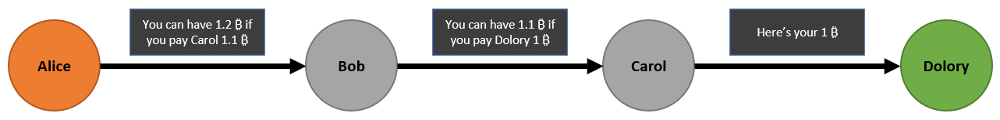
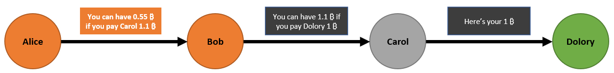

# Shared payments using the Lightning Network

## The problem
Let's say you and a random person you've just met wants to buy something online (using the Lightning Network) and split the bill. The merchant hands you a single invoice since he doesn't want to deal with the hassle of generating multiple small invoices and tracking them. Just like in real life payments, it's on you to make the split before/after the invoice is fulfilled. 
The problem arises when you can't trust your newly met friend enought to front him the money and let him pay the invoice in full. The lack of trust goes both ways and your friend is not willing to pay first and get your part from you later.

**With the current Lightning implementation it is not possible to fulfill one invoice with many payments. So how to solve this problem without using trusted third parties?**

Consider another situation, you want to donate to your favourite non-profit organization. Upon doing some research, you find that another person promises to match all donations made towards that organization. Now from the previous example we've learnd that you don't really trust some random people met on the internet to keep their word and you want a confirmation of the matched donation. The other party assures you of his good intetions and tells you "Don't worry, I will give you a screenshot of my matched donation". **What if his word is not enough for you?**

Similarly, what if the person that promises to match donations doesn't trust your screenshot as a proof of donating. After all you could've donated $1 and later photoshopped it to be $1000.

## The solution
Firstly, let's look at how a normal payment in the Lightning Network looks like.
Alice wants to send Dolory some money but doesn't have a direct channel opened with her. She routes the payment through Bob and Carol - each of them earning a tiny amount as a routing fee.

Notice that with every hop, the payment amount is getting smaller and smaller.

**What if you could construct a payment that gets bigger and bigger with every hop?**

Now let's say that Alice and Bob want to pay Dolory but agree to make it so each of them pay only half of the amount.

Of course Bob should have the unencrypted version of the Lightning packet to be sure that Alice is not trying to send the money to herself.

What's also interesing is the fact that payment confirmation on Alice's end also means that Bob payed his share. Bob or Alice can't lie about the state of their payment since it's directly connected with the payment of the other party. This non-equivocation property could possibly be used in decentralized trading application (shared liquidity pools?).

## What's next? (Proof-of-Concept)
Here's where I discovered a little problem.
As per [BOLT #4](https://github.com/lightningnetwork/lightning-rfc/blob/master/04-onion-routing.md) the forwarding amount can't be higher than the incoming hltc substracted by the routing fee:
> **amt_to_forward**: The amount, in millisatoshis, to forward to the next receiving peer specified within the routing information.
> 
> For non-final nodes, this value amount MUST include the origin node's computed fee for the receiving peer. When processing an incoming Sphinx packet and the HTLC message that it is encapsulated within, if the following inequality doesn't hold, then the HTLC should be rejected as it would indicate that a prior hop has deviated from the specified parameters:
> 
> **incoming_htlc_amt - fee >= amt_to_forward**
>
>Where fee is calculated according to the receiving peer's advertised fee schema (as described in BOLT #7).
>
>For the final node, this value MUST be exactly equal to the incoming htlc amount, otherwise the HTLC should be rejected.

### The solution 2.0

To my understang it's still possible to implement this with the current Lightning Implementations but might not be as elegant. My initial idea is to divide the payment into two parts: payment to the edge node and a normal invoice to the merchant. A rough idea has been shown below:

1. Both Alice and Bob ask Dolory to create an invoice for 1₿. Dolory creates it with randomly generated preimage and hands over the hash H 
2. Bob creates an invoice for 0.55₿ with the same preimage hash H and hands it over to Alice.

**At this point if Alice locks the required amount, Bob knows that he can pay the 1₿ which consequently allows him to unlock Alice's HTLC.**

&nbsp;&nbsp;&nbsp;&nbsp;3-6. Bob pays the invoice from 1. and receives the preimage.

7. Bob sends the preimage to Alice and gets back half of the payed amount.

You can think of it as **"invoice chaining"**, meaning that one payment can only be finalized if the other one has been paid.  

While the less-elegant version looks like it would work just fine, it's **important to realize that there's still some trust involved**. If Bob and Dolory were to collude, they could easily steal Alice's funds. I'd still consider this as an inprovement over the system where you have to split the payment in two on the merchant side or when you front the money to someone. After all, in both of these scenarios you have to trust both the merchant and the other party - with my solution you only need to trust the merchant.
